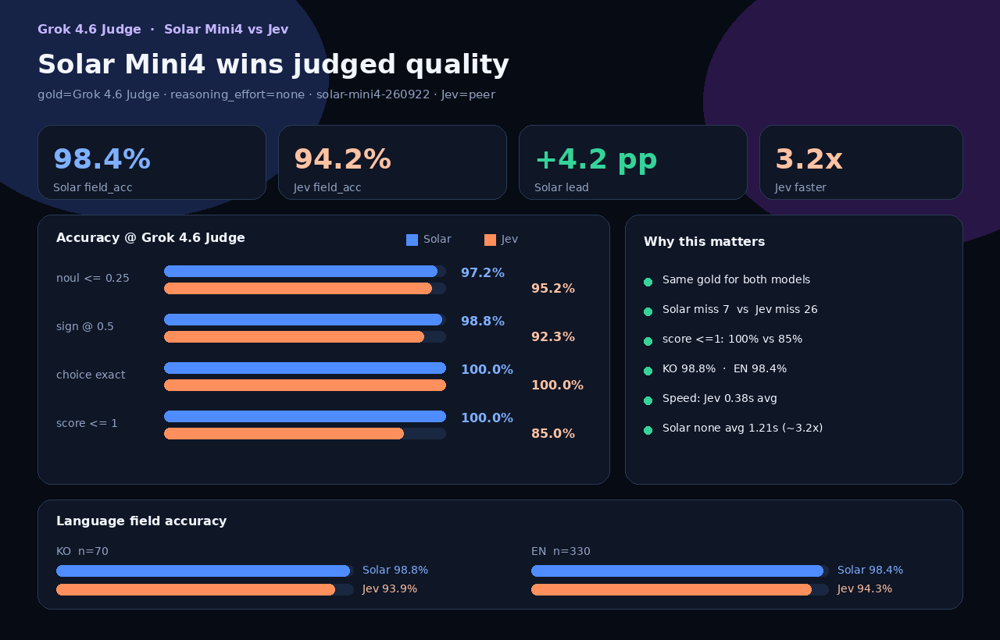
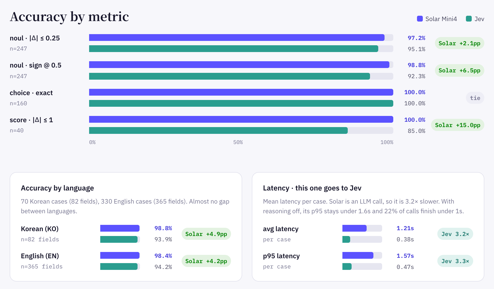

# solar-mini4-jev

A drop-in wrapper that exposes Upstage **Solar Mini4** through the TypeSafe Jev System One API shape.

```
POST /v1/systemone
{ "model": "solar-mini4-jev", "state": "...", "questions": { ... } }
```

Supported question types: `noul` | `choice` | `score` (same schema as Jev).

## Try the live API (Vercel)

Hosted BYOK endpoint — no deploy needed to try it:

- API: https://solar-mini4-jev.vercel.app
- Health: https://solar-mini4-jev.vercel.app/health
- Docs / examples: https://hunkim.github.io/solar-mini4-jev/
- LLM reference: https://hunkim.github.io/solar-mini4-jev/llms.txt

```bash
curl -s https://solar-mini4-jev.vercel.app/v1/systemone \
  -H "Content-Type: application/json" \
  -H "X-Upstage-Api-Key: $UPSTAGE_API_KEY" \
  -d '{
    "model": "solar-mini4-jev",
    "state": "Payment success rate dropped to 12%.",
    "questions": {
      "urgent": {"type": "noul", "instructions": "Should on-call be paged immediately?"}
    }
  }'
```

Bring your own [Upstage API key](https://console.upstage.ai/api-keys). The server does not store it.

## Official gold: Grok 4.6 Judge

**Jev is not the gold standard.** Jev is a peer model under comparison.
The official scoring reference is the **Grok 4.6 Judge** rubric labels (`bench/gold_grok46_judge_test400.json`).

## Results at a glance

**Judged by an independent grader (Grok 4.6 Judge), Solar Mini4 is right more often than Jev.**
Out of 447 scored answer fields, Solar Mini4 missed **7** and Jev missed **26**. On the 31 fields where the two disagree, Solar is right on 25 and Jev on 6.



Solar leads or ties on every accuracy metric, in both Korean and English. Jev keeps the speed edge at 0.38s per call against 1.21s with `reasoning_effort=none`.



Interactive scorecard: [view on GitHub Pages](https://hunkim.github.io/solar-mini4-jev/) · [source](docs/index.html) · per-case misses: [COMPARISON_GROK46_JUDGE.md](bench/COMPARISON_GROK46_JUDGE.md)

### test400 @ Grok 4.6 Judge (`solar-mini4` → `solar-mini4-260922`, `reasoning_effort=none`)

| model | field_acc | noul≤0.25 | sign@0.5 | choice | score≤1 | miss | avg latency |
|-------|----------:|----------:|---------:|-------:|--------:|-----:|------------:|
| **Solar Mini4** (`reasoning_effort=none`) | **98.4%** | **97.2%** | **98.8%** | **100%** | **100%** | **7** | **1.21s** |
| Jev 1.13.0 | 94.2% | 95.2% | 92.3% | 100% | 85.0% | 26 | **0.38s** |

Field accuracy by language:

| | KO (n=70 cases) | EN (n=330 cases) |
|--|----------:|-----------:|
| **Solar Mini4** | **98.8%** | **98.4%** |
| Jev | 93.9% | 94.3% |

**Takeaway:** Solar Mini4 wins on judged quality (`none`). Jev wins on speed (~3.2×). p50 latency 1.17s; ~22% of Solar calls are sub-1s.

## For LLMs

Machine-readable API reference: [`llms.txt`](https://hunkim.github.io/solar-mini4-jev/llms.txt)

Docs: https://hunkim.github.io/solar-mini4-jev/

## Deploy (Vercel) · BYOK System One

The live API is **Bring Your Own Key**. The server never stores your Upstage key.

```bash
# local
uvicorn server:app --host 0.0.0.0 --port 8092

# call (System One shape)
curl -s https://solar-mini4-jev.vercel.app/v1/systemone \
  -H "Content-Type: application/json" \
  -H "X-Upstage-Api-Key: $UPSTAGE_API_KEY" \
  -d '{
    "model": "solar-mini4-jev",
    "state": "Payment success rate dropped to 12%.",
    "questions": {
      "urgent": {"type": "noul", "instructions": "Should on-call be paged immediately?"}
    }
  }'
```

Auth headers (any one):
- `X-Upstage-Api-Key: <upstage_key>`
- `Authorization: Bearer <upstage_key>`

Deploy:

```bash
npx vercel@latest --prod
```

Routes:
- `GET /` — scorecard (static)
- `GET /health` — liveness
- `POST /v1/systemone` — System One API (BYOK)

No `UPSTAGE_API_KEY` is required in Vercel project env for production BYOK. Optional env only for local/dev convenience.

## Quick start

```bash
export UPSTAGE_API_KEY=...
pip install -r requirements.txt
uvicorn server:app --host 0.0.0.0 --port 8080
```

```python
from engine import system_one

out = system_one(
    state="Payment success rate dropped to 12%.",
    questions={"urgent": {"type": "noul", "instructions": "Should on-call be paged immediately?"}},
)
print(out["answers"])
```

Environment variables:
- `UPSTAGE_API_KEY` — Solar Mini4 (required). `solar-mini4` currently resolves to `solar-mini4-260922`.
- `TYPESAFE_API_KEY` — only for calling the real Jev during benchmarks (`jev_ref.py`, uses `jev-latest`, which resolved to `jev-1.13.0` for this run)
- `SOLAR_MINI_MODEL` — optional model override
- `SOLAR_REASONING_EFFORT` — default `none` (latency). `medium` is ~10×+ slower

## Layout

| path | description |
|------|------|
| `engine.py` | Solar Mini4 + Jev-compatible heuristics |
| `server.py` | FastAPI `POST /v1/systemone` |
| `jev_ref.py` | Real Jev client (for comparison) |
| `bench/gold_grok46_judge_test400.json` | **Official gold** (Grok 4.6 Judge) |
| `bench/gold_jev_test400.json` | Jev response snapshot (peer model) |
| `bench/results_test400_reasoning_none.jsonl` | Solar Mini4 results (`reasoning_effort=none`) |
| `docs/index.html` | Interactive scorecard (GitHub Pages) |
| `bench/infographic_grok46_judge*.png` | Scorecard PNG crops used in this README |

## License

Experimental / research code. Do not commit API keys.
